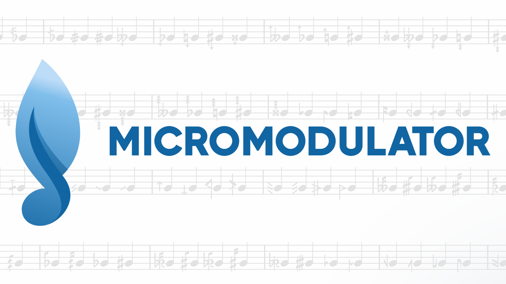

# MicroModulator
**This project has been abandoned as MuseScore now officially supports microtonal playback**

MicroModulator is a plugin for Musescore that allows the use of microtones. It efficiently adjusts the pitch of each note (whether in a selection or the entire score) based on its accidental. This plugin is designed to work seamlessly with Musescore version 4.X. To install MicroModulator, just copy the project folder into `Documents/MuseScore4/Plugins`.

_A demonstration file, showcasing all the accidentals in action, can be found at `resources/Demonstration.mscz`. Feel free to explore this file to see the functionality of the plugin in action._

## Usage
Though the current iterations of Musescore4 support a large amount of microtonal accidentals, some still are not audible especially after playback, the way that this plugin works is that it automatically retunes the notes with a special accidental. All you have to do is write your music with the accidentals that you need, select a region of music, then run the plugin through the menu, `Plugins > MicroModulator`. If you check the inspector for the tuning values, they should be set to the corresponding tone shift. 

## Contributing
We welcome contributions and fixes to this open-source project. Feel free to submit your contributions and fixes as pull requests. For any issues or questions, do open a Github Issue as I am not that active on musescore forms.
